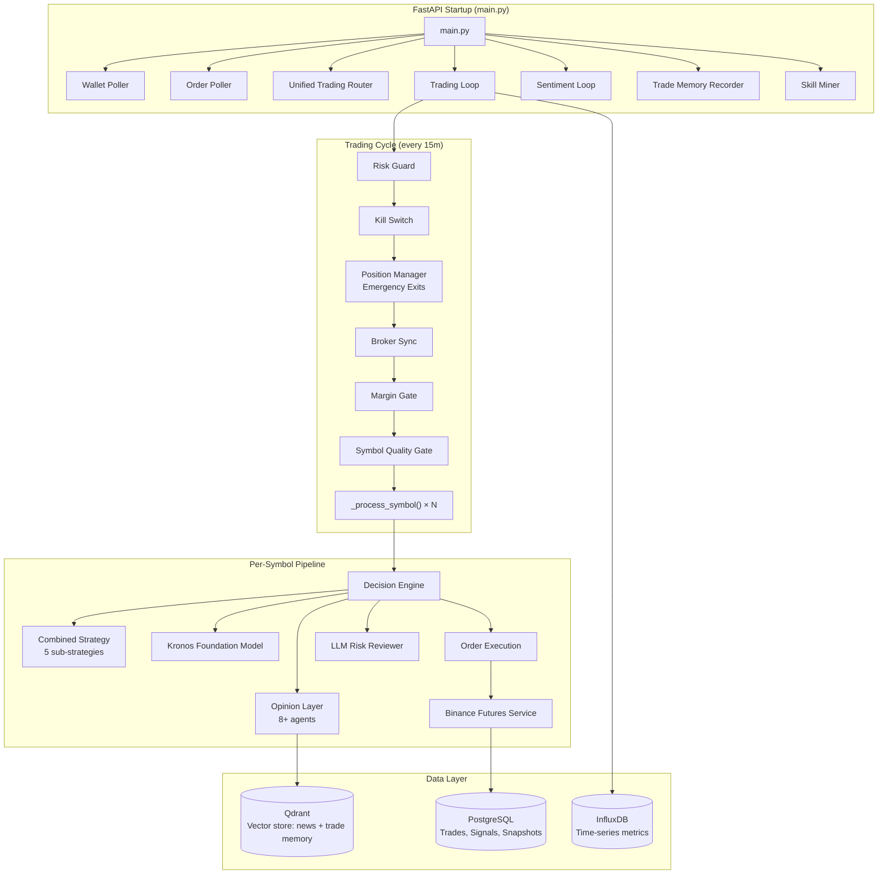

# QuantumTrade Pro — AI Hedge Fund Platform

An AI-powered multi-asset trading platform with real-time data, multi-agent analysis, workflow automation, backtesting, and risk management.

> **Note:** This project began as a fork of `virattt/ai-hedge-fund` but has been heavily customized. It now includes extensive additional features such as Binance and cTrader integrations, Kronos workflow support, n8n webhook pipelines, InfluxDB time-series storage, and Qdrant vector database integration for news and sentiment analysis. This is a fully independent and expanded project.

## System Architecture & Lifecycle

QuantumTrade Pro is engineered as a highly resilient, multi-layered AI-powered trading platform. The architecture comprises asynchronous background pollers, serialized execution loops, multi-agent consensus networks, and automated risk enforcement gates.

### Comprehensive Architecture Map



---

### Core Architectural Layers

#### 1. FastAPI Application Lifecycle & Reliability
- **Lifespan Manager**: Startup and shutdown events are managed by a FastAPI `lifespan` context manager.
- **Task Restart Supervisor**: Background tasks (wallet poller, order poller, main trading loop, sentiment loop, trade-memory recorder, and skill miner) are scheduled under an auto-restart supervisor. If any background task crashes with an unhandled exception, it is logged and automatically restarted after a 10-second delay, preventing silent failures.
- **Graceful Shutdown**: On application termination, all supervised tasks are cleanly cancelled and awaited.

#### 2. Hard Safety Gates & Risk Management
Before any trading logic evaluates a market, the loop enforces a **fail-closed stack of 9 safety gates**:
1. **Risk Guard**: Monitors rolling-window drawdown, daily loss limits, and max open positions.
2. **Kill Switch**: Hard stops all trading if account equity drops below a flat threshold (default $65).
3. **Emergency Position Manager**: Reviews open trades against live broker mark prices before position synchronization.
4. **Broker Position Sync**: Serializes database trades with actual exchange-held positions.
5. **Position Manager Exits**: Evaluates AI technical opinions to trigger early exits.
6. **Margin Gate**: Skips entry pipeline if available margin falls below a safety floor (default $5).
7. **Symbol Quality Gate**: Blocks blacklisted symbols and enforces a minimum $50M daily volume floor.
8. **Per-Symbol Engine**: Evaluates strategy signals, foundation models, and LLM vetoes.
9. **Execution Lock**: Serializes order placement across parallel symbol scans to prevent race conditions.

#### 3. Per-Symbol Decision Pipeline
Each symbol is analyzed through a multi-tiered pipeline:
- **Combined Strategy**: Evaluates 5 technical sub-strategies (trend following, momentum, mean reversion, volatility, and statistical arbitrage) to generate a base signal.
- **Kronos Foundation Model**: Runs a deep-learning time-series forecasting model to boost, dampen, or veto the signal.
- **AI Opinion Layer**: A weighted consensus network aggregating 8+ distinct analytical agents (technical analysis, foundation model, social sentiment, news archives, macro indexes, semantic trade memory, and skill miner).
- **LLM Risk Reviewer**: A final, fail-open LLM agent that acts as a Chief Risk Officer, validating the trade size, SL/TP levels, and market context before signing off on order execution.

#### 4. Dual-Mode Order Router & Brokers
- **Unified Trading Engine**: A thread-safe order router that manages both paper trading and live execution.
- **Paper Fill Engine**: Simulates a realistic order book with transaction fees, margin tracking, and real-time P&L calculation.
- **Exchange Integration**: Interfaces directly with Binance Futures (USDT-M and USDC-M perpetuals) and cTrader (Forex/CFDs) using native APIs, native SL/TP placement, and hedge-mode safety guards.

---

## Quickstart

### Prerequisites
- **Python 3.11+** with [Poetry](https://python-poetry.org/)
- **Node.js 18+** with npm

### 1. Clone & configure
```bash
git clone <your-repo-url> ai-trading-platform
cd ai-trading-platform
cp .env.example .env
# Edit .env — add your API keys
```

### 2. Run
**Windows:**
```cmd
run.bat
```

**Linux / macOS:**
```bash
chmod +x run.sh
./run.sh
```

This installs dependencies and starts both services:
- **Frontend:** http://localhost:3000
- **Backend API:** http://localhost:8080
- **API Docs:** http://localhost:8080/docs

### 3. Manual start (alternative)
```bash
# Terminal 1 — Backend
poetry install
poetry run uvicorn backend.main:app --reload --host 127.0.0.1 --port 8080

# Terminal 2 — Frontend
cd frontend
npm install
npm run dev
```

## Key Features
- 🤖 **Multi-agent AI analysis** — 12+ analyst personas (Buffett, Munger, Druckenmiller, etc.)
- 📊 **Real-time dashboard** — TradingView charts, order book, portfolio tracking
- 🔄 **Automated trading loop** — configurable interval, multi-symbol support
- 🧪 **Backtesting engine** — historical simulation with performance metrics
- 🔗 **Broker integrations** — cTrader (Forex/CFD), Binance (Crypto), and more
- 📱 **Alerts** — Telegram, InfluxDB, and n8n webhook integrations
- ⚡ **AI workflow builder** — Visual drag-and-drop strategy editor

## Disclaimer

This project is for **educational and research purposes only**. Not intended for real trading. No warranties or guarantees. Consult a financial advisor for investment decisions.
