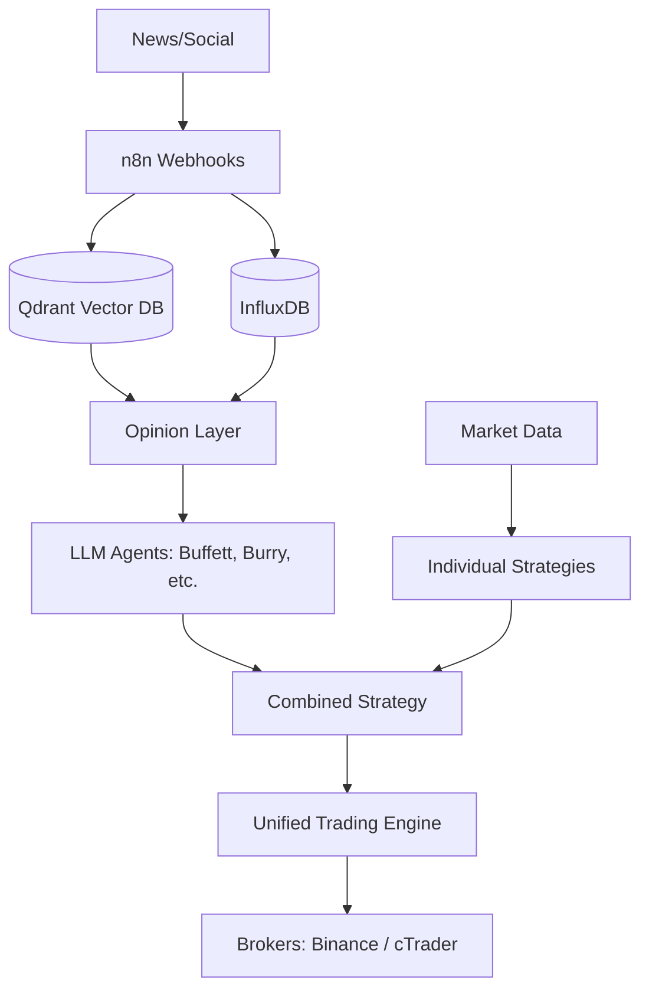

# QuantumTrade Pro — AI Hedge Fund Platform

An AI-powered multi-asset trading platform with real-time data, multi-agent analysis, workflow automation, backtesting, and risk management.

> **Note:** This project began as a fork of `virattt/ai-hedge-fund` but has been heavily customized. It now includes extensive additional features such as Binance and cTrader integrations, Kronos workflow support, n8n webhook pipelines, InfluxDB time-series storage, and Qdrant vector database integration for news and sentiment analysis. This is a fully independent and expanded project.

## Architecture

The platform architecture is divided into three main logical components:

- **Backend:** FastAPI + Trading Loop + Strategies + LLM Agents + Qdrant (Vectors) + InfluxDB (Time-series).
- **Frontend:** React dashboard featuring Portfolio View, AI Signals, Market Data, and Workflow Flows.
- **External Systems:** Broker APIs (Binance / cTrader), n8n for workflow automation, InfluxDB, and Qdrant.

### Data Flow Diagram



## Quickstart

### Prerequisites
- **Python 3.11+** with [Poetry](https://python-poetry.org/)
- **Node.js 18+** with npm

### 1. Clone & configure
```bash
git clone <your-repo-url> ai-trading-platform
cd ai-trading-platform
cp .env.example .env
# Edit .env — add your API keys
```

### 2. Run
**Windows:**
```cmd
run.bat
```

**Linux / macOS:**
```bash
chmod +x run.sh
./run.sh
```

This installs dependencies and starts both services:
- **Frontend:** http://localhost:3000
- **Backend API:** http://localhost:8080
- **API Docs:** http://localhost:8080/docs

### 3. Manual start (alternative)
```bash
# Terminal 1 — Backend
poetry install
poetry run uvicorn backend.main:app --reload --host 127.0.0.1 --port 8080

# Terminal 2 — Frontend
cd frontend
npm install
npm run dev
```

## Key Features
- 🤖 **Multi-agent AI analysis** — 12+ analyst personas (Buffett, Munger, Druckenmiller, etc.)
- 📊 **Real-time dashboard** — TradingView charts, order book, portfolio tracking
- 🔄 **Automated trading loop** — configurable interval, multi-symbol support
- 🧪 **Backtesting engine** — historical simulation with performance metrics
- 🔗 **Broker integrations** — cTrader (Forex/CFD), Binance (Crypto), and more
- 📱 **Alerts** — Telegram, InfluxDB, and n8n webhook integrations
- ⚡ **AI workflow builder** — Visual drag-and-drop strategy editor

## Disclaimer

This project is for **educational and research purposes only**. Not intended for real trading. No warranties or guarantees. Consult a financial advisor for investment decisions.
