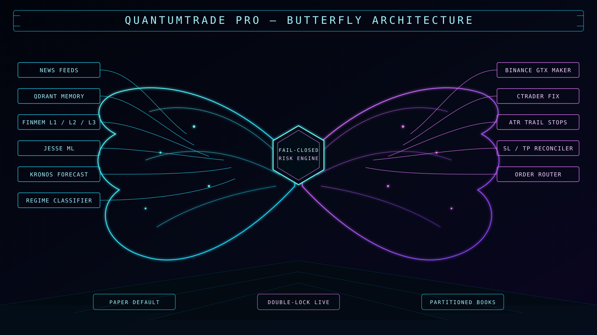
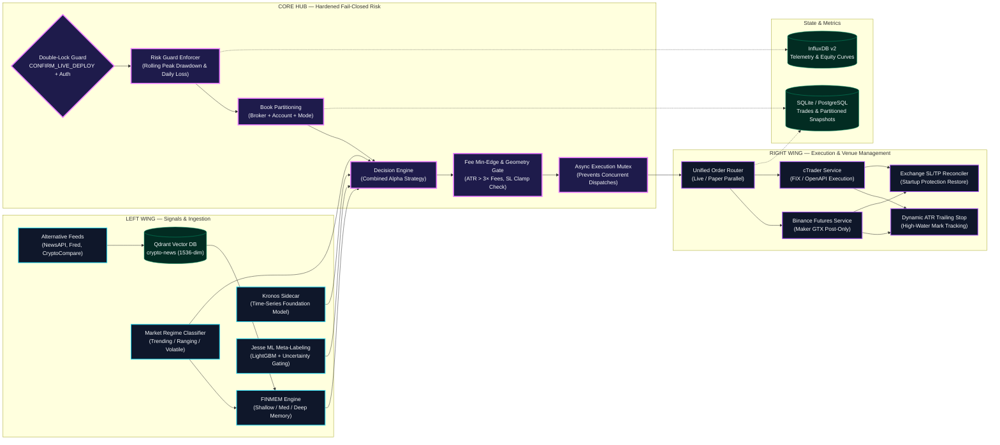
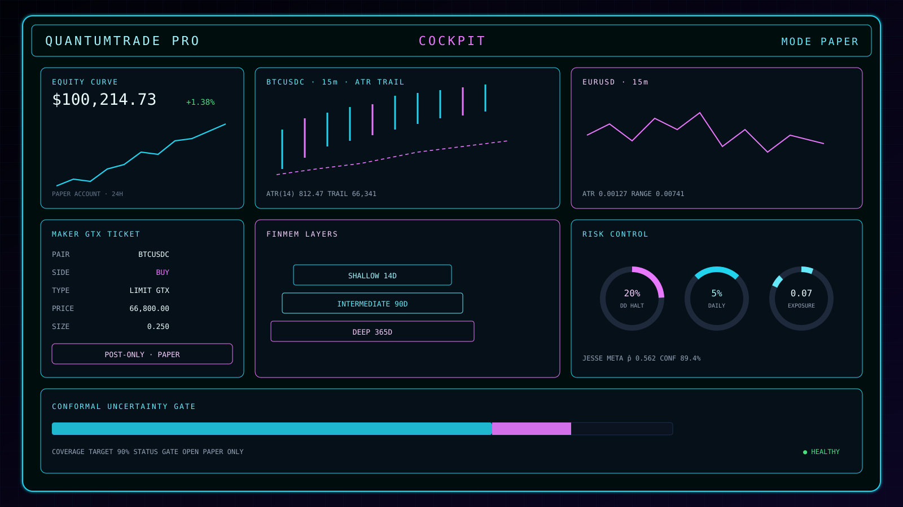

# QuantumTrade Pro — Institutional Quantitative Trading Platform

<div align="center">



[](LICENSE)
[](https://www.python.org/downloads/)
[](docker-compose.yml)
[](https://fastapi.tiangolo.com)
[](https://qdrant.tech/)
[](backend/tests/)
[](backend/security.py)

**Autonomous Multi-Broker Quantitative Execution Engine with Probability-Margin ML Gating, FINMEM Stratified Memory, and Fail-Closed Risk Enforcers.**

[Architecture](#butterfly-architecture-map) • [Quant Stack](#institutional-quant-stack) • [Risk & Safety](#fail-closed-safety-stack) • [Deployment](#quickstart--production-deployment) • [API & Telemetry](#api-telemetry--monitoring)

</div>

---

## Overview

**QuantumTrade Pro** is an institutional-grade algorithmic trading and risk execution system designed for continuous 24/7 autonomous operation across **Binance Futures** (crypto perpetuals) and **cTrader** (institutional FX and metals).

Evolving beyond simple rule-based bots or conversational agent experiments, the platform implements a **rigorous quantitative pipeline**:
- **Execution Architecture**: Non-blocking asynchronous event loop with serialized per-symbol execution locks and GTX maker order routing.
- **Fail-Closed Safety**: Double-locked live deployment authorization, rolling drawdown halts, exchange clamp validation, and strict book partitioning (`broker + account_id + mode`).
- **Uncertainty-Gated Machine Learning**: LightGBM meta-labeling trained on Triple-Barrier events with purged cross-validation, sample uniqueness weighting, and a probability-margin + entropy uncertainty gate.
- **Cognitive Memory Layer**: Stratified FINMEM vector memory in Qdrant across shallow (14d), intermediate (90d), and deep (365d) reflection horizons.

---

## Butterfly Architecture Map

The system is organized into a balanced, symmetric **Butterfly Architecture**:
- **Left Wing (Intelligent Signal & Ingestion)**: Alternative news feeds, sentiment analysis, Qdrant vector retrieval, FINMEM stratified memory, Kronos time-series forecasting, and Jesse ML meta-models.
- **Central Core (Fail-Closed Risk & Execution Hub)**: Dual-mode session routing, rolling-peak drawdown gates, directional exposure caps, min-edge fee filters, and affirmative live guards.
- **Right Wing (Multi-Broker Execution & Active Management)**: GTX maker routing on Binance, FIX/OpenAPI dispatch on cTrader, dynamic ATR trailing stops, and startup exchange SL/TP restoration.


```mermaid
flowchart LR
    classDef leftWing fill:#0f172a,stroke:#22d3ee,stroke-width:2px,color:#f8fafc;
    classDef centerCore fill:#1e1b4b,stroke:#e879ff,stroke-width:3px,color:#f8fafc;
    classDef rightWing fill:#0f172a,stroke:#a855f7,stroke-width:2px,color:#f8fafc;
    classDef storage fill:#022c22,stroke:#059669,stroke-width:1px,color:#f8fafc;

    subgraph LeftWing["LEFT WING — Signals & Ingestion"]
        direction TB
        NEWS["Alternative Feeds<br/>(NewsAPI, Fred, CryptoCompare)"]:::leftWing
        QD_NEWS[("Qdrant Vector DB<br/>crypto-news (1536-dim)")]:::storage
        FINMEM["FINMEM Engine<br/>(Shallow / Med / Deep Memory)"]:::leftWing
        REGIME["Market Regime Classifier<br/>(Trending / Ranging / Volatile)"]:::leftWing
        KRONOS["Kronos Sidecar<br/>(Time-Series Foundation Model)"]:::leftWing
        JESSE_ML["Jesse ML Meta-Labeling<br/>(LightGBM + Uncertainty Gating)"]:::leftWing

        NEWS --> QD_NEWS
        QD_NEWS --> FINMEM
        REGIME --> FINMEM
    end

    subgraph CenterCore["CORE HUB — Hardened Fail-Closed Risk"]
        direction TB
        LIVE_GATE{"Double-Lock Guard<br/>CONFIRM_LIVE_DEPLOY + Auth"}:::centerCore
        RISK_GUARD["Risk Guard Enforcer<br/>(Rolling Peak Drawdown & Daily Loss)"]:::centerCore
        BOOK_PART["Book Partitioning<br/>(Broker + Account + Mode)"]:::centerCore
        DECISION["Decision Engine<br/>(Combined Alpha Strategy)"]:::centerCore
        MIN_EDGE["Fee Min-Edge & Geometry Gate<br/>(ATR > 3× Fees, SL Clamp Check)"]:::centerCore
        EXEC_LOCK["Async Execution Mutex<br/>(Prevents Concurrent Dispatches)"]:::centerCore

        LIVE_GATE --> RISK_GUARD
        RISK_GUARD --> BOOK_PART
        BOOK_PART --> DECISION
        DECISION --> MIN_EDGE
        MIN_EDGE --> EXEC_LOCK
    end

    subgraph RightWing["RIGHT WING — Execution & Venue Management"]
        direction TB
        ROUTER["Unified Order Router<br/>(Live / Paper Parallel)"]:::rightWing
        BINANCE["Binance Futures Service<br/>(Maker GTX Post-Only)"]:::rightWing
        CTRADER["cTrader Service<br/>(FIX / OpenAPI Execution)"]:::rightWing
        ATR_TRAIL["Dynamic ATR Trailing Stop<br/>(High-Water Mark Tracking)"]:::rightWing
        RECON["Exchange SL/TP Reconciler<br/>(Startup Protection Restore)"]:::rightWing

        ROUTER --> BINANCE
        ROUTER --> CTRADER
        BINANCE --> ATR_TRAIL
        CTRADER --> ATR_TRAIL
        BINANCE --> RECON
        CTRADER --> RECON
    end

    JESSE_ML --> DECISION
    KRONOS --> DECISION
    FINMEM --> DECISION
    REGIME --> DECISION
    EXEC_LOCK --> ROUTER

    subgraph Persistence["State & Metrics"]
        SQL[(SQLite / PostgreSQL<br/>Trades & Partitioned Snapshots)]:::storage
        INFLUX[(InfluxDB v2<br/>Telemetry & Equity Curves)]:::storage
    end

    BOOK_PART -.-> SQL
    ROUTER -.-> SQL
    RISK_GUARD -.-> INFLUX
```

---

## Trading Cockpit & Risk Center

<div align="center">



*Paper-mode HUD: multi-asset telemetry, FINMEM tiers, ML uncertainty gate, and fail-closed risk limits. Not a live P&amp;L screenshot.*

</div>

---

## Institutional Quant Stack

The platform embeds financial machine learning practices inspired by Marcos López de Prado:

### 1. Robust Validation Metrics
- **Deflated Sharpe Ratio (DSR)**: Corrects for selection bias under multiple testing, non-normal return distributions (skewness/kurtosis), and track-record length ($DSR > 0.95$ threshold required for deployment).
- **Combinatorially Symmetric Cross-Validation (CSCV)**: Evaluates the Probability of Backtest Overfitting ($PBO < 0.30$), ensuring strategies do not memorize historical noise.
- **Purged K-Fold with Temporal Embargo**: Eliminates information leakage across non-independent financial observations.

### 2. Triple-Barrier Labeling & Meta-Models
- **Triple Barrier Method**: Signals are labeled using dynamic upper take-profit, lower stop-loss (volatility-adjusted via ATR), and time-out horizontal barriers.
- **Sample Uniqueness Concurrency Weighting**: Overlapping trade windows are down-weighted by inverse concurrency to eliminate label redundancy.
- **Probability-Margin Uncertainty Gating**: The prediction server scores ambiguity as the top-two class probability margin combined with Shannon entropy; ambiguous candidates are vetoed before touching capital. This is a heuristic threshold, not a split-conformal bound — there is no calibration set and no $\alpha$, so it must not be read as a calibrated error rate.
- **Fractional Kelly Sizing**: Allocations scale proportionally to model edge and uncertainty while strictly capping max directional exposure.

### 3. FINMEM Stratified Vector Memory
- **Stratified Storage in Qdrant**:
  - *Shallow Tier* ($Q=14$ days, decay factor $\alpha=0.900$): Tracks high-frequency market regimes and short-term volatility shocks.
  - *Intermediate Tier* ($Q=90$ days, decay factor $\alpha=0.967$): Captures quarterly macro rotations, central bank cycles, and earnings seasons.
  - *Deep Tier* ($Q=365$ days, decay factor $\alpha=0.988$): Retains historical structural extremes, flash crashes, and liquidity regimes.
- **Dynamic Cognitive Persona Switching**: Automatically modulates between *Risk-Seeking* and *Risk-Averse* behavioral profiles depending on market condition consensus and trailing drawdown.

---

## Fail-Closed Safety Stack

| Safety Layer | Implementation | Fail-Safe Behavior |
|---|---|---|
| **Live Deploy Double-Lock** | `CONFIRM_LIVE_DEPLOY=true` + `ADMIN_API_KEY` | Refuses process startup if either flag or authentication token is missing. |
| **API Boundary Lockdown** | Constant-time HMAC on all `/trading/*` routes | Blocks unauthorized information dumps of positions, balances, or bot telemetry (401/403). |
| **Image Worker Ceiling** | Dockerfile CMD set to `--workers 1` | Prevents split-brain loops, duplicate pyramid maps, and concurrency collisions. |
| **Fail-Safe Testnet Fallback** | Compose default `${BINANCE_TESTNET:-true}` | If `.env` omits the testnet flag, the platform defaults to simulated execution. |
| **Rolling Peak Drawdown** | Lookback window of 72 hours (configurable) | Halts new entries when equity drops below limit (20%) in live production; safely suppressed during testing/sandbox (`DISABLE_DRAWDOWN_IN_TESTING=true` or sandbox broker). Exits continue running. |
| **Multi-Broker Isolation** | `broker + account_id + mode` partitioning | Paper Binance fills never alter cTrader live equity or trip live risk boundaries. |
| **Maker GTX Execution** | Post-only orders with market fallback | Captures maker rebates (0.02% vs 0.05% taker fees); cancels orders that would cross the spread. |
| **Broker Clamp Guard** | Minimum stop-pip distance & effective R:R gate | Rejects trade setups whose planned risk:reward is crushed by broker-enforced minimum stops. |

---

## Quickstart & Production Deployment

### 1. Prerequisites
- Docker 24.0+ & Docker Compose v2+
- Node.js 18+ (for local frontend cockpit development)
- Python 3.11+ (for local scripts or backtest runners)

### 2. Environment Setup
```bash
# Clone the repository
git clone https://github.com/inimene84/ai-trading-platform.git
cd ai-trading-platform

# Copy example environment configuration
cp .env.example .env

# Generate a strong 256-bit Admin API Key
python3 -c "import secrets; print('ADMIN_API_KEY=' + secrets.token_hex(32))" >> .env
```

### 3. Launch Services via Docker Compose
```bash
# Launch core platform: backend, litellm, and nginx proxy
docker compose up -d

# Check running container health
docker compose ps
```

### 4. Verify System Health
```bash
# Public health check
curl -s http://localhost:8001/health

# Authenticated trading status check
curl -s -H "X-API-Key: YOUR_ADMIN_API_KEY" http://localhost:8001/trading/status
```

---

## API, Telemetry & Monitoring

- **REST API & Documentation**: Available at `http://localhost:8001/docs` (OpenAPI) and `http://localhost:8001/redoc`.
- **Grafana Dashboards**: Port `3000` (time-series PnL, open margin, trade duration, Sharpe ratio).
- **InfluxDB v2 Metrics**: Port `8086` (bucket: `news-sentiment`, `trading-system`).
- **Qdrant Vector Console**: Port `6333` (collections: `crypto-news`, `trade-memory`, `finmem-memory`).
- **Telegram Watchdog**: Real-time push notifications on entry fills, trailing stop activations, and risk halts.

---

## Repository Hygiene & Upstream Attribution

- **License**: Distributed under the [Apache License 2.0](LICENSE).
- **Original Fork Attribution**: This platform originated as a fork of [`virattt/ai-hedge-fund`](https://github.com/virattt/ai-hedge-fund) (Copyright 2024 virattt and contributors). It has been completely rebuilt as an institutional-grade, multi-broker automated algorithmic execution system.

---

## Disclaimer

This software is for **research, educational, and quantitative development purposes only**. Algorithmic trading in leveraged perpetual futures, foreign exchange, and derivative contracts involves substantial risk of loss. Past backtested performance is not indicative of future results. No financial advice or warranties are provided.
