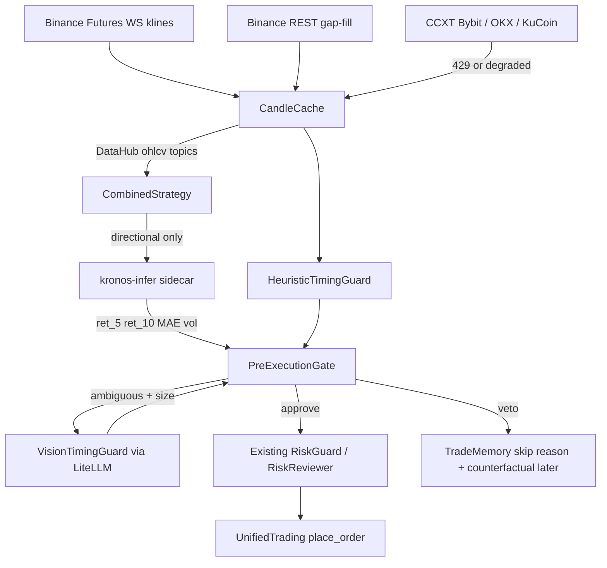

# Plan: Advanced Trade Timing (Kronos + Vision) & Multi-Provider OHLCV

Status: **Ready to implement** (architecture locked; Anticravity local draft is input, not source of truth on `main`)  
Goal: Cut post-entry −10–15% drawdowns via hard pre-execution timing vetoes, and cut Binance REST weight by serving models from cached / multi-provider candles.

Inspiration (patterns only — do not vendor whole repos):
- [shiyu-coder/Kronos](https://github.com/shiyu-coder/Kronos) — OHLCV foundation forecast
- [olaxbt/ai-market-maker](https://github.com/olaxbt/ai-market-maker) — hard Risk Guard veto before OMS
- [virattt/ai-hedge-fund](https://github.com/virattt/ai-hedge-fund) — desk separation (signal vs timing vs risk)

---

## 0. Current baseline on `main` (do not assume local files are merged)

| Area | Today | Gap |
|------|--------|-----|
| `backend/services/kronos.py` | SMA stub (`KronosPredictor` fake DF) | Real NeoQuasar weights + official predictor |
| `backend/services/kronos_service.py` | Lazy load → falls through to stub; returns next-bar only | 5/10-bar path metrics + cache key |
| `backend/services/kronos_gate.py` | BOOST / VETO / DAMPEN (FLIP removed) | Path-based veto + Vision/heuristic inputs |
| `backend/services/decision_engine.py` | Kronos after strategy, before opinion | Pre-execution gate package; no double Kronos |
| `backend/services/opinion_layer.py` | Can call Kronos again (`include_kronos=True`) | Reuse DecisionEngine prediction |
| `backend/services/trading_loop.py` `_fetch_bars` | Binance REST → yfinance | Cache-first + CCXT futures fallback |
| `backend/services/binance_market_data.py` | REST + TTL + semaphore | WS kline feed + publish to DataHub |
| `backend/services/data_hub.py` | Generic pub/sub | Topics `ohlcv:{symbol}:{interval}` |
| Vision / multi-provider modules | **Absent on `main`** | New services (port from local only after review) |
| Deps | No `torch` / `mplfinance` / `ccxt` in `pyproject.toml` | Sidecar owns torch; backend may add `ccxt`, `mplfinance` |

Local Anticravity work (vision guard, multi-provider, upgraded kronos) is a **candidate patch**. Diff it against this plan before merge; do not treat “10 tests passed” as production proof until green on this repo’s CI.

---

## 1. Locked decisions

| Question | Decision |
|----------|----------|
| Where does Kronos run? | **Sidecar** `ai-trading-kronos` (HTTP). Backend stays lean; VPS backend memory cap is already 6G. |
| Which model first? | `NeoQuasar/Kronos-mini` + `NeoQuasar/Kronos-Tokenizer-2k` via official `KronosPredictor`. |
| In-process torch fallback? | Dev/local only (`KRONOS_MODE=sidecar\|local\|stub`). Prod default = `sidecar`. |
| Vision on every trade? | **No.** Heuristic timing first; Vision LLM only if Kronos is weak/adverse *or* notional ≥ threshold. |
| Chart layout | **Dual MTF:** 1h primary (structure) + 15m secondary (entry timing). 60–100 bars each. |
| Data for models | Prefer **Binance WS/cache**; REST cold-start/gap-fill; CCXT Bybit→OKX→KuCoin on 429/degraded. |
| Yahoo / CoinGecko for crypto timing? | **No** for futures timing. Keep yfinance only as last-resort equity-style fallback if already used. |
| Execution venue | Unchanged — Binance / cTrader for orders only. Alt venues are **market data**, not OMS. |
| Gate philosophy | Hard **veto / dampen / boost** only. Never FLIP (already proven harmful). |
| Fail policy | Paper: Kronos/Vision fail → pass-through with log. Live: Kronos timeout → **fail-closed** if `KRONOS_FAIL_CLOSED=true` (default true in live). Vision fail → no vision veto. |
| Thresholds v1 | Starting defaults only; calibrate from veto counterfactuals (Phase 4). |

### Default gate thresholds (v1 — tunable via env)

```text
KRONOS_VETO_RET5_PCT=-1.2          # BUY veto if forecast 5-bar cum return ≤ this
KRONOS_VETO_MAE_PCT=2.0            # BUY veto if forecast path max adverse ≥ this
KRONOS_BOOST_MIN_CONF=0.70         # existing boost floor
KRONOS_VETO_MIN_CONF=0.45          # direction opposition (legacy gate) still applies
HEURISTIC_RISK_VETO=0.70
VISION_RISK_VETO=0.65
VISION_MIN_NOTIONAL_USD=150        # skip Vision below this unless Kronos dampens
```

---

## 2. Target architecture



Pipeline order in DecisionEngine (after strategy confidence / funding gates):

1. Fetch bars from **CandleCache** (not raw REST every cycle).
2. `kronos_service.predict` → sidecar (cached by `symbol|interval|last_ts`).
3. `apply_kronos_gate` (path metrics + direction).
4. `HeuristicTimingGuard` (cheap, always-on when enabled).
5. Optional `VisionTimingGuard`.
6. Existing opinion / risk reviewer / risk guard / OMS.

---

## 3. Work packages (implementation tickets)

### WP0 — Inventory local Anticravity patch (half day)

- Diff local files vs `main`:
  - `kronos.py`, `kronos_service.py`, `kronos_gate.py`
  - claimed `vision_timing_guard.py`, `multi_provider_data.py`
  - any DecisionEngine / trading_loop hooks
- Keep: real predictor wiring ideas, gate composition, chart prompt.
- Drop / rewrite: Yahoo-first crypto paths, in-process torch in API image, FLIP logic, uncalibrated “10 passed” tests that mock everything into green.
- Output: short merge notes in PR description (what reused vs rewritten).

### WP1 — CandleCache + Binance WS (API weight)

**Touch**
- `backend/services/binance_market_data.py` — add WS kline subscriber for `TRADING_SYMBOLS` + intervals `15m`,`1h`
- `backend/services/data_hub.py` — document topics; optional longer TTL for OHLCV
- **NEW** `backend/services/candle_cache.py` — ring buffer per `(symbol, interval)`, `get(symbol, interval, limit)`, gap detection
- `backend/services/trading_loop.py` `_fetch_bars` — cache-first; REST only if `< min_bars` or stale
- Tests: `backend/tests/unit/test_candle_cache.py`

**Done when**
- Trading loop scan of N symbols does not N× REST `/fapi/v1/klines` every cycle after warm-up.
- Metrics/log: `candle_source=ws|rest|ccxt|cache`.

### WP2 — Multi-provider OHLCV fallback

**Touch**
- **NEW** `backend/services/multi_provider_ohlcv.py` (name preferred over `multi_provider_data.py`)
- Provider order: `binance_cache` → `binance_rest` → `bybit` → `okx` → `kucoin` (CCXT futures)
- Normalize to platform bar dict: `date, open, high, low, close, volume`
- Dep: add `ccxt` to Poetry
- Tests: provider failover with mocked clients; no live network in unit tests

**Done when**
- Forced Binance 429 path still returns ≥50 bars from next provider for a known symbol.
- Orders still only via existing brokers.

### WP3 — Kronos sidecar + service contract

**New service** (compose)
- `services/kronos_infer/` or `kronos_infer/` — thin FastAPI:
  - `GET /health`
  - `POST /predict` body: OHLCV rows + `pred_len` → trajectory DF summary
- Image installs Kronos deps (`torch` CPU wheel, model cache volume)
- Compose: `ai-trading-kronos`, internal port, memory limit separate from backend
- Env: `KRONOS_URL=http://ai-trading-kronos:8080`, `KRONOS_MODE=sidecar`

**Touch**
- Replace stub behavior in `kronos.py` with thin client **or** keep stub only for `KRONOS_MODE=stub`
- Vendor/copy official `KronosPredictor` usage from [shiyu-coder/Kronos](https://github.com/shiyu-coder/Kronos) into sidecar (MIT) — do not reinvent tokenizer
- `kronos_service.py` response shape:

```json
{
  "signal": "BUY|SELL|NEUTRAL",
  "confidence": 0.0,
  "predicted_close": 0.0,
  "predicted_change_pct": 0.0,
  "ret_5_pct": 0.0,
  "ret_10_pct": 0.0,
  "path_mae_pct": 0.0,
  "path_vol_pct": 0.0,
  "cached": false,
  "model": "NeoQuasar/Kronos-mini",
  "error": null
}
```

- Cache predictions in-process + optional DataHub topic `kronos:{symbol}:{interval}:{ts}`
- DecisionEngine: pass kronos_result into opinion layer; set `include_kronos=False` when already computed
- Tests: contract tests with mocked HTTP; stub mode still unit-testable without torch

**Done when**
- `ENABLE_KRONOS=true` + healthy sidecar returns non-stub trajectory on paper loop.
- Backend image does **not** require torch.

### WP4 — Pre-execution gate (Kronos path + heuristic + optional vision)

**Touch**
- `backend/services/kronos_gate.py` → keep `apply_kronos_gate`; add `apply_pre_execution_gate(...)` composing:
  1. Kronos path veto (ret_5 / MAE)
  2. Heuristic timing risk
  3. Optional vision risk
- **NEW** `backend/services/heuristic_timing_guard.py` — wick ratio, engulfs, RSI divergence proxy, BB touch, volume dry-up → `risk_score` 0–1
- **NEW** `backend/services/vision_timing_guard.py` — `mplfinance` render → LiteLLM vision (Gemini/GPT-4o) structured JSON; heuristic-only if `VISION_TIMING_ENABLED=false`
- `decision_engine.py` — call `apply_pre_execution_gate` after Kronos predict; record skip reasons in `last_evaluation`
- Trade memory features: `timing_veto_reason`, `kronos_ret_5`, `vision_risk` (optional columns/context)

**Vision prompt contract (strict JSON)**
```json
{
  "approved": true,
  "risk_score": 0.0,
  "rejection_reason": "",
  "patterns": ["upper_wick_rejection"]
}
```

**Done when**
- Synthetic “blow-off top” bars → heuristic or Kronos veto before `place_order`.
- Vision disabled by default in CI; one mocked vision parse test.

### WP5 — Observability & calibration

- Log structured event: `timing_gate` with symbol, action, ret_5, mae, heuristic, vision, latency_ms
- Grafana/Influx (if already used for signals): counter `timing_veto_total{reason=...}`
- Offline script `scripts/calibrate_timing_gate.py`:
  - For each historical veto/skip, compute next 5/10 bar return
  - Recommend threshold adjustments
- Paper A/B flag: `TIMING_GATE_SHADOW=true` (compute veto but do not block) for first deploy

**Done when**
- One week shadow mode report: % of would-be −10% entries caught vs false veto rate.

---

## 4. Env / compose knobs (add to `.env.example`)

```text
# Kronos
ENABLE_KRONOS=true
KRONOS_MODE=sidecar
KRONOS_URL=http://ai-trading-kronos:8080
KRONOS_FAIL_CLOSED=true
KRONOS_VETO_RET5_PCT=-1.2
KRONOS_VETO_MAE_PCT=2.0

# Timing guards
HEURISTIC_TIMING_ENABLED=true
VISION_TIMING_ENABLED=false
VISION_TIMING_MODEL=gemini/gemini-2.0-flash
VISION_RISK_VETO=0.65
VISION_MIN_NOTIONAL_USD=150
TIMING_GATE_SHADOW=true

# Market data
OHLCV_WS_ENABLED=true
OHLCV_INTERVALS=15m,1h
OHLCV_CCXT_FALLBACK=true
OHLCV_PROVIDER_ORDER=binance_cache,binance_rest,bybit,okx,kucoin
```

---

## 5. Explicit non-goals (v1)

- Fine-tuning Kronos on proprietary fills (Phase later; use upstream finetune scripts only after baseline metrics).
- Replacing CombinedStrategy / opinion personas with AIMM LangGraph.
- Chart image APIs / TradingView screenshots (local render only).
- Using Vision as primary alpha signal.
- Hitting Binance REST from Kronos/Vision paths when cache is warm.

---

## 6. Verification plan

### Automated
```bash
poetry run pytest \
  backend/tests/unit/test_candle_cache.py \
  backend/tests/unit/test_multi_provider_ohlcv.py \
  backend/tests/unit/test_kronos_service.py \
  backend/tests/unit/test_kronos_gate.py \
  backend/tests/unit/test_heuristic_timing_guard.py \
  backend/tests/unit/test_vision_timing_guard.py \
  backend/tests/unit/test_decision_engine.py \
  backend/tests/unit/test_daily_loss_bleed_fixes.py
```

### Manual / paper
1. `TIMING_GATE_SHADOW=true`, `KRONOS_MODE=sidecar`, `VISION_TIMING_ENABLED=false`
2. Run loop on `BTCUSDC,ETHUSDC` through ≥1 volatile session
3. Confirm logs: `candle_source=cache|ws`, Kronos latency, shadow vetoes
4. Spot-check 5 shadow vetoes on chart — expect exhaustion / dump paths
5. Flip shadow off for paper only after false-veto rate acceptable

### Merge gate for local Anticravity code
- [ ] No torch in `Dockerfile.backend` runtime (sidecar only)
- [ ] No FLIP action restored
- [ ] Provider order matches §1
- [ ] Dual-TF vision only when enabled
- [ ] Deduped Kronos vs opinion layer
- [ ] Unit tests run offline

---

## 7. Suggested PR sequence

1. **PR-A** WP1 CandleCache + WS + `_fetch_bars` (safe, immediate REST relief)
2. **PR-B** WP2 CCXT multi-provider fallback
3. **PR-C** WP3 Kronos sidecar + service contract + dedupe
4. **PR-D** WP4 Heuristic + gate composition + optional Vision
5. **PR-E** WP5 Shadow metrics + calibration script

Do not ship C+D in one PR if sidecar ops are unproven on the VPS.

---

## 8. Success metrics

| Metric | Target |
|--------|--------|
| Post-entry −10% within 5–10 bars (entries that passed gate) | Material drop vs pre-change baseline |
| Binance kline REST calls / loop cycle | Near-zero after WS warm-up |
| Kronos p95 latency (CPU mini) | Budget logged; loop not blocked (async + timeout) |
| False veto rate (shadow → would have been +R winners) | Tuned before live hard veto |
| Live incidents from Kronos OOM in API container | Zero (sidecar isolation) |

---

## 9. Immediate next step

Start **PR-A (CandleCache + WS)** on a feature branch, and in parallel open WP0 diff of the local Anticravity folder against `main` so WP3/WP4 can reuse good pieces without importing stub regressions.
